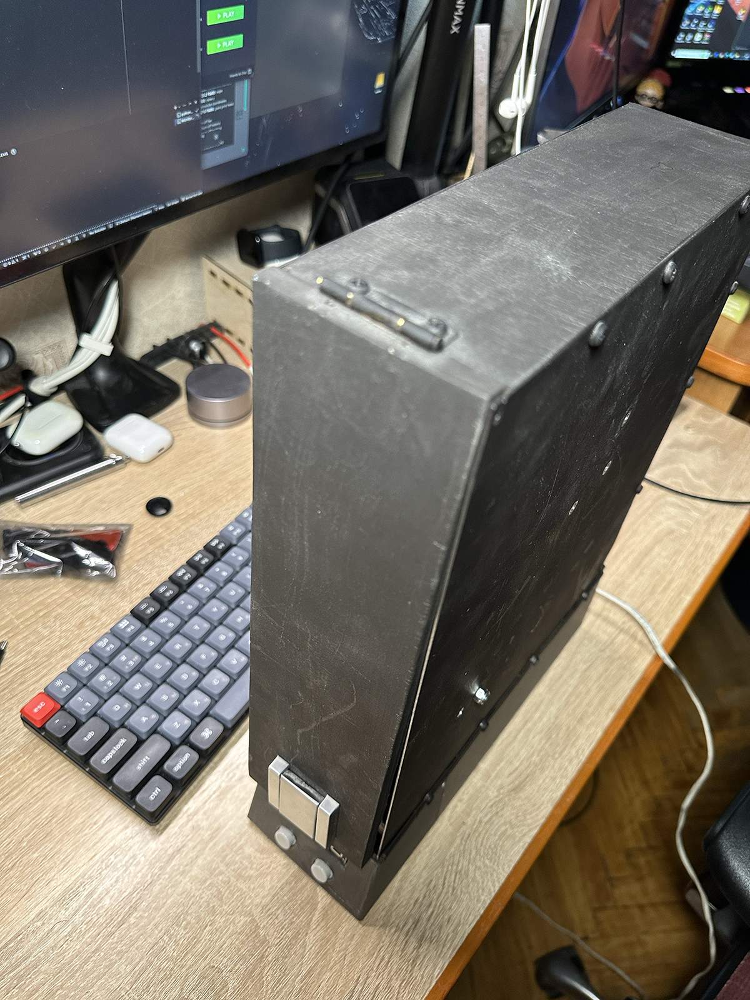
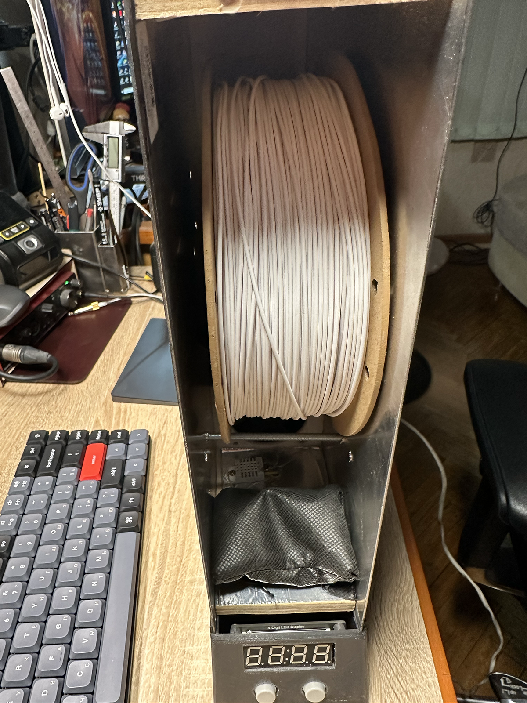
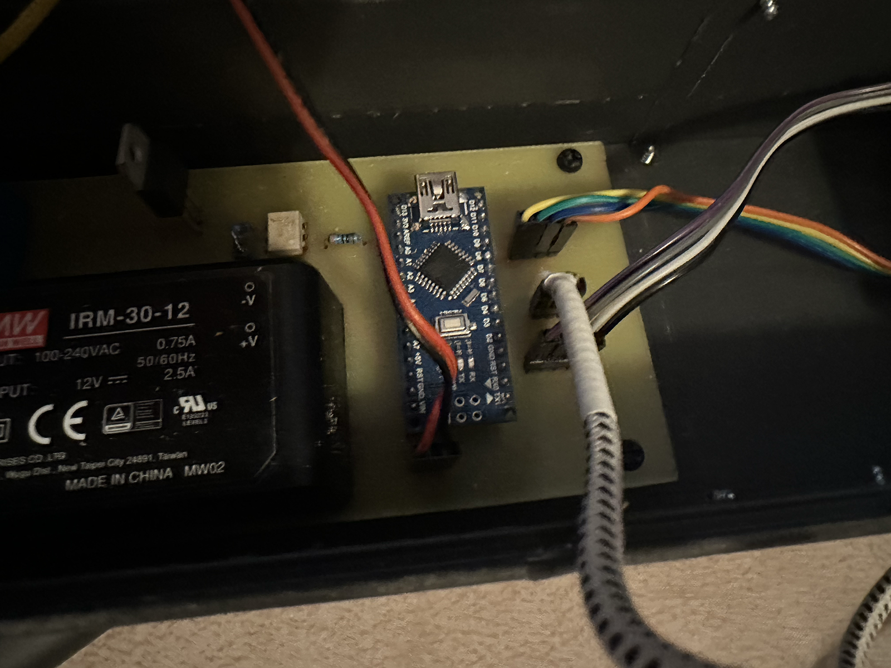
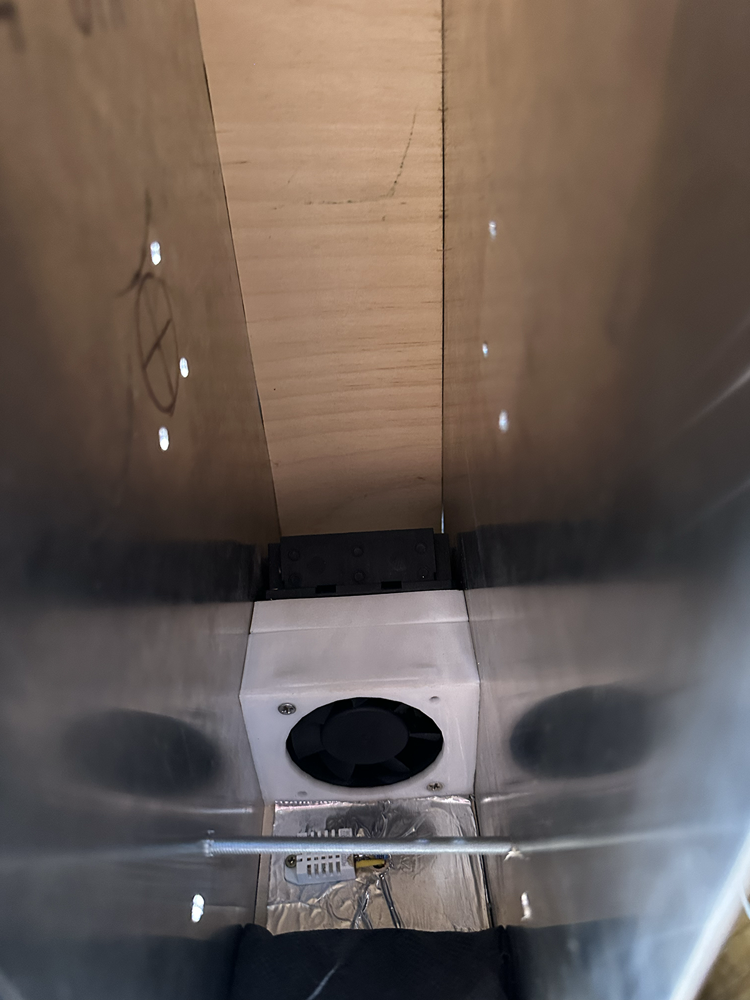
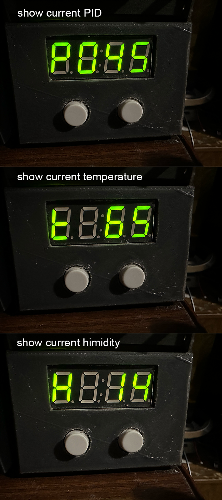

# Filament dryer

This is a filament dryer that I designed and built.

  
  &nbsp;
  

Box made from 2mm aluminium sheets and polywood. Electrincics are housed in a 3D printed box.

The dryer is powered by a 12V 2.5A power supply. The heater is a 220V 40W heater. The fan is a 12V 0.2A fan.
The dryer is controlled by an Arduino (Farduino nano) and a DHT22 sensor.

 

The Arduino connected to 4-digit 7-segment display and two buttons - plus and minus.

If buttons are pressed, the temperature can be adjusted. The temperature is displayed on the 4-digit 7-segment display.

After 20 seconds of inactivity, screen swiches to display current parameters - pid, temperature and humidity.

The dryer can be used to dry out filament that has absorbed moisture from the air.
